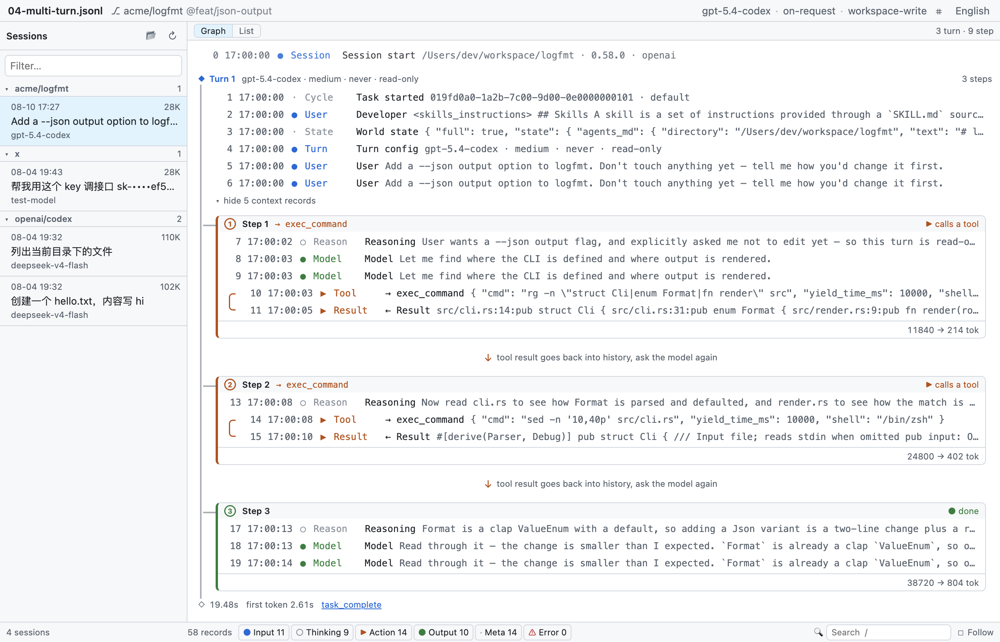

# codex-unroll

**A read-only desktop viewer for [OpenAI Codex CLI](https://github.com/openai/codex) session rollout logs.**
Turn `~/.codex/sessions/**/rollout-*.jsonl` into a searchable timeline you can actually read — and follow live while the agent runs.

**English** · [中文](./README.zh-CN.md)



---

## The problem

Every Codex CLI session writes a complete execution trace to
`$CODEX_HOME/sessions/YYYY/MM/DD/rollout-<timestamp>-<session_id>.jsonl`:
user input → prompt assembly → model response → tool calls → tool output → token usage → next turn.

It is the only ground truth for what the agent actually did. It is also unreadable:

| lines | size | **chars per line** |
|---:|---:|---:|
| 19 | 102.8 KB | **5,538** |
| 17 | 109.8 KB | **6,612** |
| 9 | 100.7 KB | **11,459** |

**Very few lines, but 5,000–11,500 characters each.** One line of 11,000 characters is dozens of
screens of terminal spam — that is why `cat` floods your scrollback, and why `jq` aborts the whole
file the moment it hits one malformed line.

This is not a long-list problem. It is a *few gigantic objects* problem.

## What it does

### Graph view

The session rebuilt as Codex actually executes it: `Session ▸ Turn ▸ Step`, a vertical chain.
Each Step is one model request; a Step that calls a tool feeds the result back into history and
the loop continues (▶), a Step that only replies exits the loop (●). That is the ReAct loop,
made visible. Press `g` to switch between graph and list.

The hierarchy is taken from Codex's own source, `codex-rs/core/src/tasks/mod.rs` — note that
**Task and Turn are the same level**, not two. Step boundaries are inferred from `token_count`
events (the usage report emitted after each model request); this matched all four real samples.
It is a heuristic, not a protocol guarantee, so the fallback is benign: a turn with no
`token_count` degrades into a single unclosed Step with **every entry still present**.

Because the frozen config is rendered per Turn, a session that changes sandbox or approval policy
mid-conversation shows it — `read-only / never` on Turn 1, `workspace-write / on-request` on Turn 2.


### Everything else

- **Timeline** — one fixed-height line per record, never wrapped. The whole session structure fits on one screen.
- **Detail panel** — select a row, read the full content on the right with its own scrollbar. Exactly two levels of drill-down, no deeper.
- **Six-group filter** — input / thinking / action / output / meta / error, with live counts.
- **Full-text search** — across titles, content, and raw JSON.
- **Live follow** — `tail -f` for agent runs, but readable. Debounced incremental reads; only auto-scrolls when you are already at the bottom.
- **Project grouping** — sessions grouped by git repository, groups ordered by most recent activity.
- **Secret redaction** — API keys, bearer tokens, JWTs, AWS and GitHub tokens masked by default, last 4 characters kept.
- **Light / dark** — follows the system theme.
- **English / 中文** — follows the system language by default, switchable from the top bar.

> The UI language only affects the *UI*. Session content, tool names and command output are
> data — they render as-is in any language, and translating them would be wrong. By the same
> rule, full-text search matches the wording **you are looking at**: search `Model` in English,
> `模型` in Chinese. Otherwise "search what you see" stops being true.


## Design note

**This is a browsing problem over a few gigantic objects, not over a long list.**

So the timeline carries structure only — each record is exactly one line and never wraps — and all
content goes to the detail panel on the right, rather than being stuffed into list rows that expand.

```
┌─────────────────────────────────────────────────────────────┐
│ ⌘ filename          deepseek-v4-flash · never · read-only ⚙ │
├──────────┬──────────────────────────┬───────────────────────┤
│ sessions │ timeline                 │ detail (on select)    │
│ ▾openai/ │ 0 ● session start        │ custom_tool_call      │
│  codex 2 │ 1 ● turn config never/ro │ apply_patch           │
│ 08-04    │ 2 ● user   create hello… │ ──────────────────    │
│ 18:28    │ 3 ○ reason I'll add…     │ *** Begin Patch       │
│ 08-04    │ 4 ▶ tool   apply_patch ◀─│ *** Add File: hello…  │
│ 11:13 ◀  │ 5 ▶ result rejected ⚠    │ +hi                   │
│          │ 6 ● model  I could not…  │ *** End Patch         │
│          │ 7 ● done   14058ms       │ ▾ raw JSON            │
├──────────┼──────────────────────────┴───────────────────────┤
│ 4 sess.  │ 19 rec · ●6 ○2 ▶2 ●4 ·5 · 🔍/ · ☑follow         │
└──────────┴──────────────────────────────────────────────────┘
```

Four consequences follow: every timeline row has a fixed single-line height; the detail panel
renders only on selection; drill-down is **exactly two levels**; and the top is a single status
bar, with no summary-card area.

## Robustness

Malformed lines degrade to a visible `_parse_error` entry and parsing continues — unlike `jq`, one
bad line never costs you the rest of the file. Unknown `payload.type` values render as `other`
instead of being dropped, so the viewer keeps working when Codex adds new record types.


## Privacy

Rollout files can contain your API keys and private source code. Three hard constraints:

| | |
|---|---|
| 🔒 **Fully offline** | No telemetry, no update checks, no uploads. Ever. |
| 📖 **Read-only** | Never writes, deletes, or modifies any rollout file. |
| 🙈 **Redacted by default** | Secrets masked in both the rendered view and the raw-JSON panel (`sk-••••b6b2`). No "reveal" toggle. |

Keeping the last 4 characters is deliberate: debugging needs you to tell *which* key was used.
The author once chased a 401 where the error showed `****b6cQ` while the configured key ended in
`b6b2` — those 4 characters revealed that Codex was sending a completely different key.
Masking everything would have destroyed that signal.

Redaction happens in the normalization layer, before data reaches the UI, so `preview` and
`rawPretty` are covered by construction — the raw-JSON panel is what people actually copy into
bug reports, and it is the easiest place to leak from.

## Install

No published binaries yet. Build from source:

```bash
git clone https://github.com/Te0228/codex-unroll.git
cd codex-unroll
npm install
npm start
```

Requires Node 20+. macOS first; Windows and Linux should work but are untested.

## Development

```bash
npm install
npm start                          # dev mode
CODEX_HOME=$(pwd)/test npm start   # run against the test fixtures
npm test                           # 460 unit tests
npm run test:cov                   # coverage (90% threshold on src/shared/)
npm run typecheck
npm run lint                       # oxlint
npm run make                       # package a zip

# End-to-end smoke: runs 5 steps, prints PASS/FAIL per assertion, leaves 5 screenshots
CODEX_HOME=$(pwd)/test UNROLL_SHOT=/tmp/shots npm start

# The smoke pins the UI language (zh-CN by default). Both README screenshot sets come from it:
UNROLL_LOCALE=en CODEX_HOME=$(pwd)/test UNROLL_SHOT=/tmp/shots npm start
```

> Pinning the language in the smoke run is not optional. Without it the run follows the system
> language of whatever machine executes it — Chinese screenshots on the author's laptop, English
> ones in CI, and both "pass".

The linter is **oxlint**, not ESLint: `typescript@7` is the native tsgo build and does not expose
the classic compiler API (`TypeFlags` / `createProgram` are all `undefined`), so
`@typescript-eslint` cannot work. oxlint parses TS/JSX itself and does not depend on the
`typescript` package.

### Stack

Electron Forge · Vite · React 19 · TypeScript · Vitest · oxlint

### Docs

| File | Contents |
|---|---|
| [SPEC.md](./SPEC.md) | Authoritative design doc: data-source spec, UI spec, IPC contract, security constraints, acceptance assertions |
| [CLAUDE.md](./CLAUDE.md) | Context for AI coding assistants: current progress, known traps, hard constraints |
| [test/fixtures/README.md](./test/fixtures/README.md) | Test fixture notes |

## Status

**v0.1 feature-complete; v0.2 adds the graph view; v0.3 adds English/Chinese localization.**
460 unit tests, 100% line coverage on the normalization layer, end-to-end smoke suite passing
41/41 in each of the two languages.

## Distribution

[GitHub Releases](../../releases) only (zip). **Not published to npm.**

---

## License

[MIT](./LICENSE)

---

*Not affiliated with OpenAI. Codex is a product of OpenAI.*
