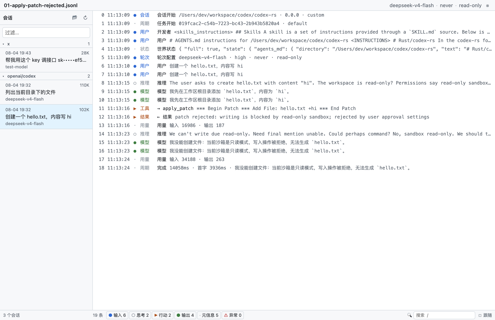
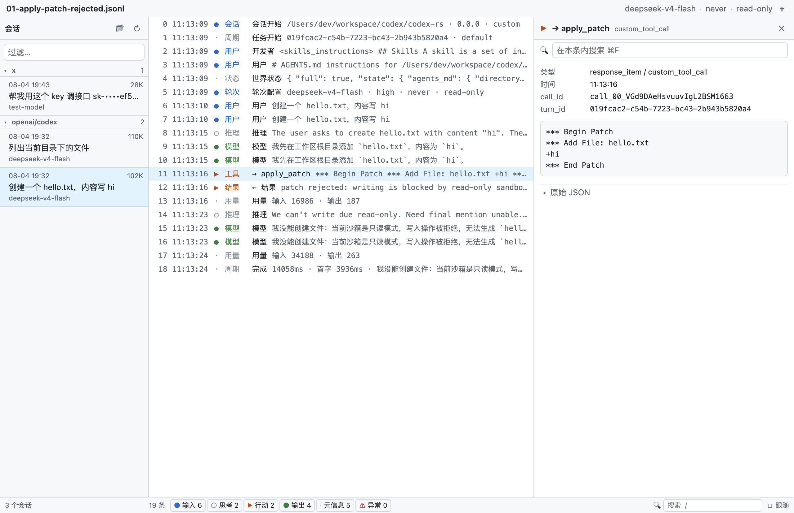
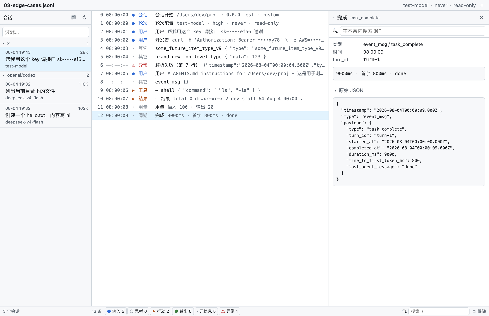

# codex-unroll

**A read-only desktop viewer for [OpenAI Codex CLI](https://github.com/openai/codex) session rollout logs.**
Turn `~/.codex/sessions/**/rollout-*.jsonl` into a searchable timeline you can actually read — and follow live while the agent runs.

> **Unroll your Codex sessions** —— 把 Codex CLI 的 rollout JSONL 摊开成可读的时间线。

[English](#english) · [中文](#中文)



---

## English

### The problem

Every Codex CLI session writes a complete execution trace to
`$CODEX_HOME/sessions/YYYY/MM/DD/rollout-<timestamp>-<session_id>.jsonl`:
user input → prompt assembly → model response → tool calls → tool output → token usage → next turn.

It is the only ground truth for what the agent actually did. It is also unreadable:

| lines | size | **chars per line** |
|---:|---:|---:|
| 19 | 102.8 KB | **5,538** |
| 17 | 109.8 KB | **6,612** |
| 9 | 100.7 KB | **11,459** |

**Very few lines, but 5,000–11,500 characters each.** One line of 11,000 characters is dozens of
screens of terminal spam — that is why `cat` floods your scrollback, and why `jq` aborts the whole
file the moment it hits one malformed line.

This is not a long-list problem. It is a *few gigantic objects* problem.

### What it does

- **Timeline** — one fixed-height line per record, never wrapped. The whole session structure fits on one screen.
- **Detail panel** — select a row, read the full content on the right with its own scrollbar. Exactly two levels of drill-down, no deeper.
- **Six-group filter** — input / thinking / action / output / meta / error, with live counts.
- **Full-text search** — across titles, content, and raw JSON.
- **Live follow** — `tail -f` for agent runs, but readable. Debounced incremental reads; only auto-scrolls when you are already at the bottom.
- **Project grouping** — sessions grouped by git repository, groups ordered by most recent activity.
- **Secret redaction** — API keys, bearer tokens, JWTs, AWS and GitHub tokens masked by default, last 4 characters kept.
- **Light / dark** — follows the system theme.



### Robustness

Malformed lines degrade to a visible `_parse_error` entry and parsing continues — unlike `jq`, one
bad line never costs you the rest of the file. Unknown `payload.type` values render as `other`
instead of being dropped, so the viewer keeps working when Codex adds new record types.



### Privacy

Rollout files can contain your API keys and private source code. Three hard constraints:

| | |
|---|---|
| 🔒 **Fully offline** | No telemetry, no update checks, no uploads. Ever. |
| 📖 **Read-only** | Never writes, deletes, or modifies any rollout file. |
| 🙈 **Redacted by default** | Secrets masked in both the rendered view and the raw-JSON panel (`sk-••••b6b2`). No "reveal" toggle. |

Keeping the last 4 characters is deliberate: debugging needs you to tell *which* key was used.
The author once chased a 401 where the error showed `****b6cQ` while the configured key ended in
`b6b2` — those 4 characters revealed that Codex was sending a completely different key.
Masking everything would have destroyed that signal.

Redaction happens in the normalization layer, before data reaches the UI, so `preview` and
`rawPretty` are covered by construction — the raw-JSON panel is what people actually copy into
bug reports, and it is the easiest place to leak from.

### Install

No published binaries yet. Build from source:

```bash
git clone https://github.com/Te0228/codex-unroll.git
cd codex-unroll
npm install
npm start
```

Requires Node 20+. macOS first; Windows and Linux should work but are untested.

### Status

**v0.1 feature-complete.** 321 unit tests, 100% line coverage on the normalization layer,
end-to-end smoke suite passing 17/17 against both the dev build and the packaged app.

---

## 中文

### 为什么需要它

Codex CLI 每次会话都会写一份完整的执行轨迹 JSONL：
用户输入 → 提示词组装 → 模型响应 → 工具调用 → 工具结果 → token 用量。

这是理解 agent 行为的**唯一真实记录**，但它没法读。实测本机 8 份 rollout：

| 行数 | 体积 | 单行平均字符数 |
|---:|---:|---:|
| 19 | 102.8 KB | **5 538** |
| 17 | 109.8 KB | **6 612** |
| 9 | 100.7 KB | **11 459** |

**行数极少，但每行 5 000–11 500 字符。** 一行 11 000 字符在终端里就是几十屏刷屏——
`cat` 刷屏、`jq` 遇到一个坏行就整体中止。

### 设计要点

**这是"少量巨型对象"的浏览问题，不是长列表问题。**

所以时间线只承载结构（每条固定一行、永不换行），内容全部交给右侧详情面板——
而不是把大段内容塞进列表行里再展开。

```
┌─────────────────────────────────────────────────────────────┐
│ ⌘ 文件名           deepseek-v4-flash · never · read-only  ⚙ │
├──────────┬──────────────────────────┬───────────────────────┤
│ 会话      │ 时间线                    │ 详情（选中才出现）      │
│ ▾openai/ │ 0 ● 会话开始              │ custom_tool_call      │
│  codex 2 │ 1 ● 轮次配置 never/ro     │ apply_patch           │
│ 08-04    │ 2 ● 用户   创建 hello…    │ ──────────────────    │
│ 18:28    │ 3 ○ 推理   I'll add…      │ *** Begin Patch       │
│ 08-04    │ 4 ▶ 工具   apply_patch ◀──│ *** Add File: hello…  │
│ 11:13 ◀  │ 5 ▶ 结果   rejected ⚠     │ +hi                   │
│          │ 6 ● 模型   我没能创建…     │ *** End Patch         │
│          │ 7 ● 完成   14058ms        │ ▾ 原始 JSON           │
├──────────┼───────────────────────────┴───────────────────────┤
│ 3 个会话  │ 19 条 · ●6 ○2 ▶2 ●4 ·5 · 🔍/ · ☑跟随            │
└──────────┴───────────────────────────────────────────────────┘
```

由此推出的四条：时间线每条固定单行高；详情面板选中才渲染；下钻**恰好两层**；
顶部只有一行状态条，不做摘要卡片区。

### 功能

- **时间线** — 每条固定一行，一屏看完整场会话的结构
- **详情面板** — 选中条目后在右侧展开完整内容，独立滚动
- **分类过滤** — 输入 / 思考 / 行动 / 输出 / 元信息 / 异常，六组，带计数
- **全文搜索** — 跨标题、内容、原始 JSON
- **实时跟随** — agent 正在跑的时候跟着看，像 `tail -f` 但可读
- **项目分组** — 按 git 仓库分组，组按最新活动排序
- **密钥脱敏** — API key 默认遮蔽，保留尾 4 位便于排障
- **深浅色** — 跟随系统

### 隐私与安全

rollout 文件里可能包含你的 API key 和私有代码。因此本项目有三条硬约束：

| | |
|---|---|
| 🔒 **完全不联网** | 不做遥测、不检查更新、不上传任何数据 |
| 📖 **只读** | 绝不写、删、改任何 rollout 文件 |
| 🙈 **密钥脱敏** | 显示层与原始 JSON 面板同时遮蔽（`sk-••••b6b2`），**不提供"显示明文"开关** |

保留尾 4 位是刻意的：排障时需要**区分是哪一把 key**。
作者曾遇到一个 401，报错显示 `****b6cQ` 而配置里的 key 尾号是 `b6b2`——
正是这 4 位揭示了「发出去的根本不是你配的那把 key」。全遮就丢掉了这个关键信息。

### 技术栈

Electron Forge · Vite · React 19 · TypeScript · Vitest · oxlint

### 开发

```bash
npm install
npm start                          # 开发模式
CODEX_HOME=$(pwd)/test npm start   # 用测试夹具当数据源
npm test                           # 321 条单测
npm run test:cov                   # 覆盖率（src/shared/ 门槛 90%）
npm run typecheck
npm run lint                       # oxlint
npm run make                       # 打包 zip

# 端到端冒烟：自动走完 4 步、逐条打印 PASS/FAIL、留 4 张截图
CODEX_HOME=$(pwd)/test UNROLL_SHOT=/tmp/shots npm start
```

> linter 是 **oxlint** 而非 ESLint：`typescript@7` 是原生 tsgo 版，不暴露经典编译器 API
> （`TypeFlags` / `createProgram` 全是 `undefined`），`@typescript-eslint` 因此无法工作。
> oxlint 自己解析 TS/JSX，不依赖 `typescript` 包。

### 文档

| 文件 | 内容 |
|---|---|
| [SPEC.md](./SPEC.md) | 权威设计文档：数据源规格、UI 规格、IPC 契约、安全约束、验收断言 |
| [CLAUDE.md](./CLAUDE.md) | 给 AI 编码助手的上下文：当前进度、踩过的坑、硬约束 |
| [test/fixtures/README.md](./test/fixtures/README.md) | 测试夹具说明 |

### 分发

只发 [GitHub Release](../../releases)（zip），**不发 npm**。

---

## License

[MIT](./LICENSE)

---

*本项目与 OpenAI 无关联。Codex 是 OpenAI 的产品。*
*Not affiliated with OpenAI. Codex is a product of OpenAI.*
