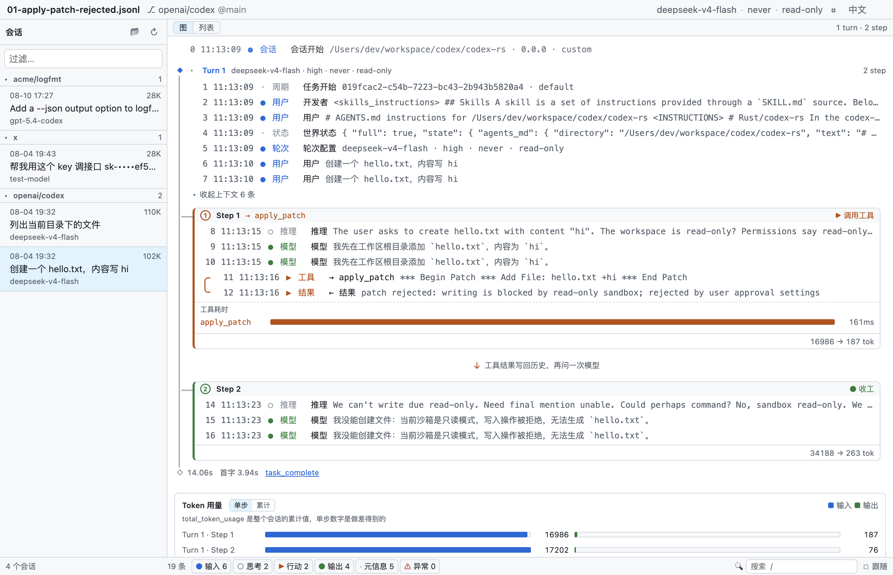
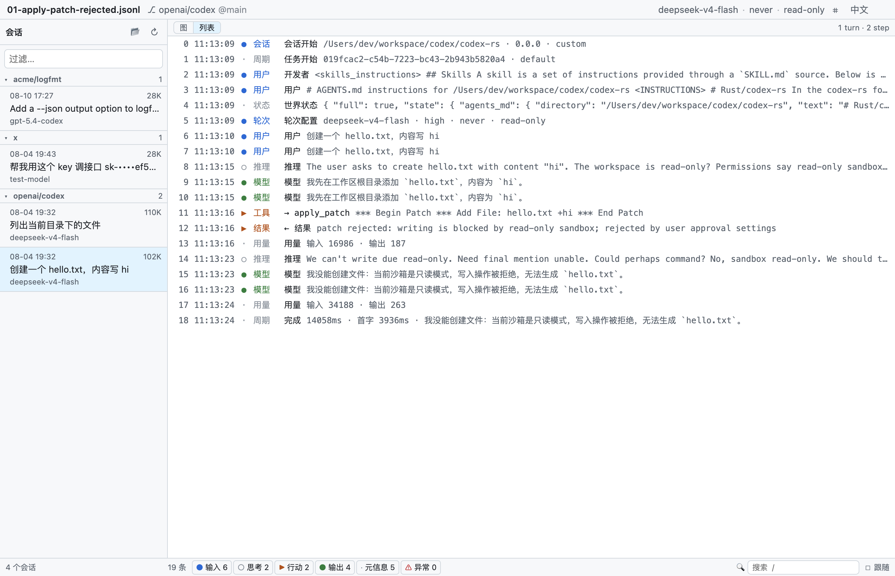
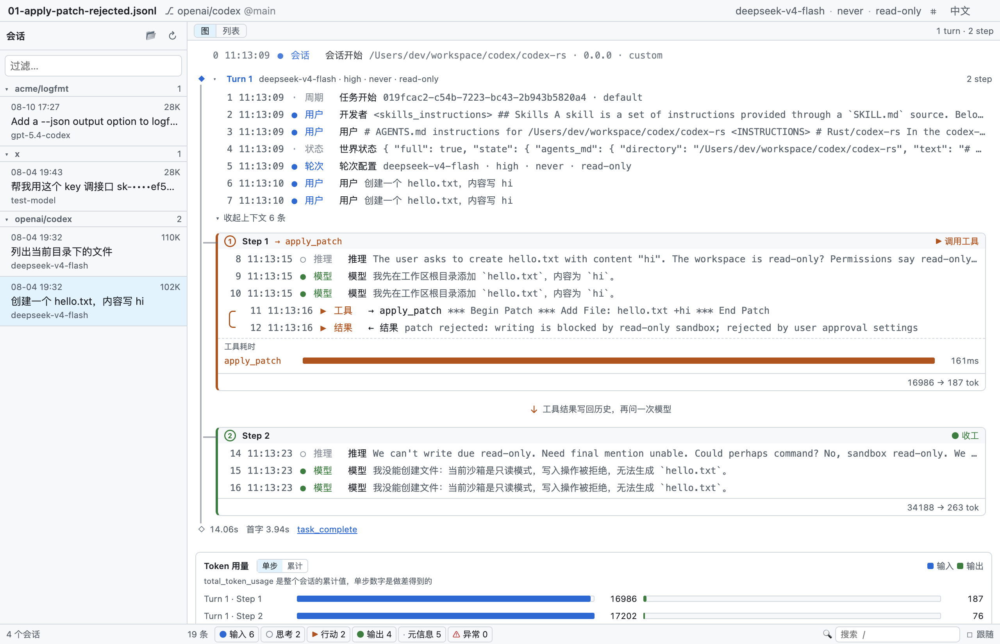
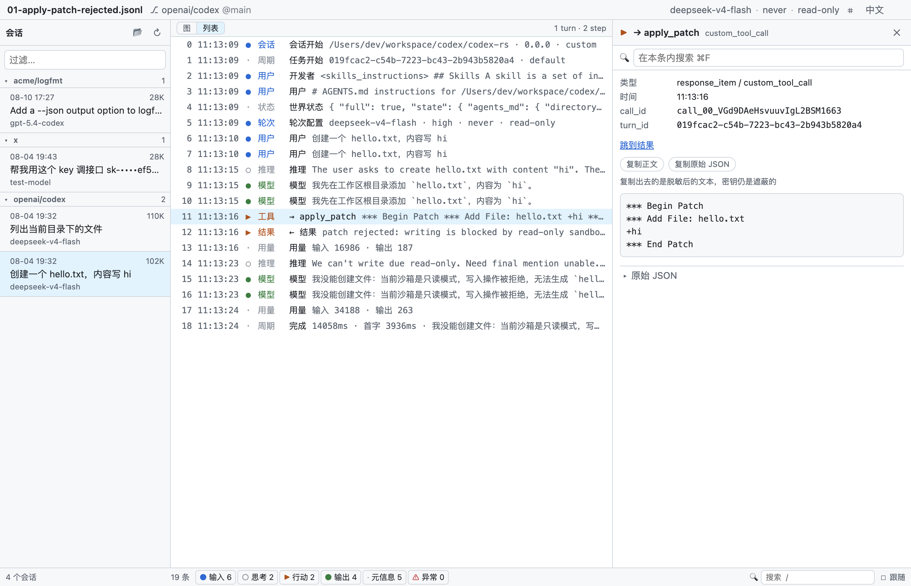
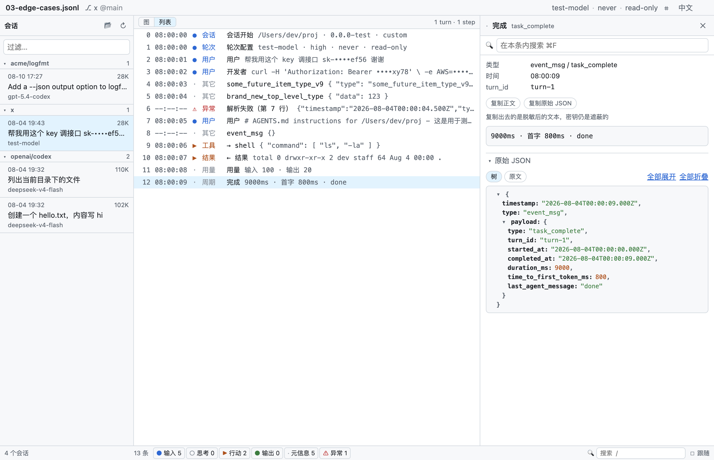

# codex-unroll

**[OpenAI Codex CLI](https://github.com/openai/codex) 会话 rollout 日志的只读桌面查看器。**
把 `~/.codex/sessions/**/rollout-*.jsonl` 摊开成能读的时间线——agent 正在跑的时候也能跟着看。

[English](./README.md) · **中文**



---

## 为什么需要它

Codex CLI 每次会话都会写一份完整的执行轨迹到
`$CODEX_HOME/sessions/YYYY/MM/DD/rollout-<时间戳>-<session_id>.jsonl`：
用户输入 → 提示词组装 → 模型响应 → 工具调用 → 工具结果 → token 用量 → 下一轮。

这是理解 agent 行为的**唯一真实记录**，但它没法读。实测本机 8 份 rollout：

| 行数 | 体积 | 单行平均字符数 |
|---:|---:|---:|
| 19 | 102.8 KB | **5 538** |
| 17 | 109.8 KB | **6 612** |
| 9 | 100.7 KB | **11 459** |

**行数极少，但每行 5 000–11 500 字符。** 一行 11 000 字符在终端里就是几十屏刷屏——
`cat` 刷屏、`jq` 遇到一个坏行就整体中止。

这不是长列表的浏览问题，是**少量巨型对象**的浏览问题。

## 功能

### 图视图

按 Codex 真实的执行层级重建会话：`Session ▸ Turn ▸ Step` 竖向链。
一个 Step = 一次模型请求；调了工具就把结果写回历史、循环继续（▶），
只回消息就出环（●）。turn loop 是个 ReAct 循环，这样看最直观。`g` 键在图/列表间切换。

层级取自 Codex 源码 `codex-rs/core/src/tasks/mod.rs`——注意 **Task 和 Turn 是同一层**。
Step 边界靠 `token_count` 事件推断（每次模型请求后的用量上报），4 份真实样本全部吻合。
这是**启发式，不是协议保证**，所以退化路径是良性的：一个 `token_count` 都没有的 Turn
会整体退化成一个未收尾的 Step，**内容一条不少**。

冻结配置是**逐 Turn** 渲染的，所以一场会话中途改了沙箱或审批策略，图里直接看得出来——
Turn 1 是 `read-only / never`，Turn 2 变成 `workspace-write / on-request`。



### 其余

- **时间线** — 每条固定一行、永不换行，一屏看完整场会话的结构
- **详情面板** — 选中条目后在右侧展开完整内容，独立滚动。下钻**恰好两层**，不再深
- **工具调用配对** — `function_call` 与它的 `_output` 靠 `call_id` 关联，详情面板内互跳。
  配不上时（被中断、文件截断）按钮直接不显示，而不是点了没反应
- **耗时条与用量图** — 每个工具调用一条耗时条，每个 Step 一根用量柱。
  ★ 用量画的是**单步增量**而不是 `total_token_usage` 本身：那个字段是**会话累计值**，
  直接画会得到一条永远向上的斜线，看着像每步暴涨，其实只是累计量
- **复制** — 正文或原始 JSON，复制出去的一律是**脱敏后**的文本
- **整轮折叠 / 大内容分段** — 长会话可整轮折起；AGENTS.md 这类注入按 markdown 标题分段


- **分类过滤** — 输入 / 思考 / 行动 / 输出 / 元信息 / 异常，六组，带实时计数
- **全文搜索** — 跨标题、内容、原始 JSON
- **实时跟随** — agent 正在跑的时候跟着看，像 `tail -f` 但可读。去抖增量读；只有你已经在底部时才自动滚
- **项目分组** — 按 git 仓库分组，组按最新活动排序
- **密钥脱敏** — API key、bearer token、JWT、AWS 与 GitHub token 默认遮蔽，保留尾 4 位
- **深浅色** — 跟随系统
- **中英双语** — 默认跟随系统语言，顶栏可切换

> 界面语言只影响**界面**。会话内容、工具名、命令输出是数据，任何语言下都原样显示——
> 翻译它们才是错的。同理，全文搜索搜的是你**眼前那个语言**的文案：中文界面搜「模型」、
> 英文界面搜「Model」，「所见即可搜」才成立。



## 设计要点

**这是「少量巨型对象」的浏览问题，不是长列表问题。**

所以时间线只承载结构（每条固定一行、永不换行），内容全部交给右侧详情面板——
而不是把大段内容塞进列表行里再展开。

```
┌─────────────────────────────────────────────────────────────┐
│ ⌘ 文件名           deepseek-v4-flash · never · read-only  ⚙ │
├──────────┬──────────────────────────┬───────────────────────┤
│ 会话      │ 时间线                    │ 详情（选中才出现）      │
│ ▾openai/ │ 0 ● 会话开始              │ custom_tool_call      │
│  codex 2 │ 1 ● 轮次配置 never/ro     │ apply_patch           │
│ 08-04    │ 2 ● 用户   创建 hello…    │ ──────────────────    │
│ 18:28    │ 3 ○ 推理   I'll add…      │ *** Begin Patch       │
│ 08-04    │ 4 ▶ 工具   apply_patch ◀──│ *** Add File: hello…  │
│ 11:13 ◀  │ 5 ▶ 结果   rejected ⚠     │ +hi                   │
│          │ 6 ● 模型   我没能创建…     │ *** End Patch         │
│          │ 7 ● 完成   14058ms        │ ▾ 原始 JSON           │
├──────────┼───────────────────────────┴───────────────────────┤
│ 4 个会话  │ 19 条 · ●6 ○2 ▶2 ●4 ·5 · 🔍/ · ☑跟随            │
└──────────┴───────────────────────────────────────────────────┘
```

由此推出的四条：时间线每条固定单行高；详情面板选中才渲染；下钻**恰好两层**；
顶部只有一行状态条，不做摘要卡片区。

## 健壮性

不合法的行降级成一条可见的 `_parse_error` 条目，解析继续——不像 `jq`，一个坏行
不会让你丢掉整个文件的其余部分。未知的 `payload.type` 渲染成 `other` 而不是丢弃，
所以 Codex 新增记录类型时查看器照常能用。



## 隐私与安全

rollout 文件里可能包含你的 API key 和私有代码。因此本项目有三条硬约束：

| | |
|---|---|
| 🔒 **完全不联网** | 不做遥测、不检查更新、不上传任何数据 |
| 📖 **只读** | 绝不写、删、改任何 rollout 文件 |
| 🙈 **密钥脱敏** | 显示层与原始 JSON 面板同时遮蔽（`sk-••••b6b2`），**不提供「显示明文」开关** |

保留尾 4 位是刻意的：排障时需要**区分是哪一把 key**。
作者曾遇到一个 401，报错显示 `****b6cQ` 而配置里的 key 尾号是 `b6b2`——
正是这 4 位揭示了「发出去的根本不是你配的那把 key」。全遮就丢掉了这个关键信息。

脱敏发生在归一化层、数据到达 UI 之前，所以 `preview` 和 `rawPretty` 是**由构造保证**
被覆盖的——原始 JSON 面板才是大家真正会复制进 bug report 的地方，也最容易漏。

## 安装

暂无预编译产物，从源码构建：

```bash
git clone https://github.com/Te0228/codex-unroll.git
cd codex-unroll
npm install
npm start
```

需要 Node 20+。以 macOS 为主；Windows 和 Linux 理论可用，但未测试。

## 开发

```bash
npm install
npm start                          # 开发模式
CODEX_HOME=$(pwd)/test npm start   # 用测试夹具当数据源
npm test                           # 546 条单测
npm run test:cov                   # 覆盖率（src/shared/ 门槛 90%）
npm run typecheck
npm run lint                       # oxlint
npm run make                       # 打包 zip

# 端到端冒烟：自动走完 5 步、逐条打印 PASS/FAIL、留 5 张截图
CODEX_HOME=$(pwd)/test UNROLL_SHOT=/tmp/shots npm start

# 冒烟会钉住语言（默认 zh-CN）。README 的两套截图就是这么出的：
UNROLL_LOCALE=en CODEX_HOME=$(pwd)/test UNROLL_SHOT=/tmp/shots npm start
```

> 冒烟**必须**钉住语言。不钉的话它会跟着跑它那台机器的系统语言走——
> 同一份代码在作者机器上出中文截图、在 CI 上出英文截图，而两边都「通过」。

> linter 是 **oxlint** 而非 ESLint：`typescript@7` 是原生 tsgo 版，不暴露经典编译器 API
> （`TypeFlags` / `createProgram` 全是 `undefined`），`@typescript-eslint` 因此无法工作。
> oxlint 自己解析 TS/JSX，不依赖 `typescript` 包。

### 技术栈

Electron Forge · Vite · React 19 · TypeScript · Vitest · oxlint

### 文档

| 文件 | 内容 |
|---|---|
| [SPEC.md](./SPEC.md) | 权威设计文档：数据源规格、UI 规格、IPC 契约、安全约束、验收断言 |
| [CLAUDE.md](./CLAUDE.md) | 给 AI 编码助手的上下文：当前进度、踩过的坑、硬约束 |
| [test/fixtures/README.md](./test/fixtures/README.md) | 测试夹具说明 |

## 状态

**v0.1 功能完成；v0.2 加了图视图；v0.3 加了中英双语；v0.4 把 P1 清单做完了**
（配对互跳、整轮折叠、耗时条、用量图、复制、大内容分段）。**546 条单测**，
归一化层行覆盖率 100%，端到端冒烟在中英两种语言下各 **51/51** 通过。

## 分发

只发 [GitHub Release](../../releases)（zip），**不发 npm**。

---

## License

[MIT](./LICENSE)

---

*本项目与 OpenAI 无关联。Codex 是 OpenAI 的产品。*
